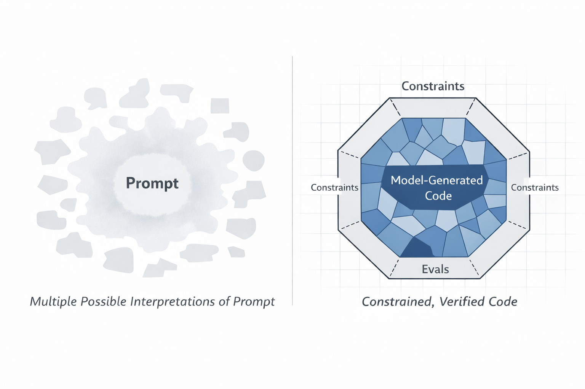

AI is making implementation cheap and precision expensive.

Programming changes. Typically, we progress up the ladder of abstraction, removing a layer of manual detail at each rung. We moved from assembly to FORTRAN, from lower-level systems languages to higher-level managed ones, and then to scripting languages like Python. Each step let programmers express more intent and less machinery.

Coding agents look like the next step. You describe behavior in English, and the machine writes code. Are we just progressing to the next level of abstraction?

Consider the most popular coding languages in history: C, Java, Python. These are all formal languages. English is not.

---

### Code vs Language

When I write a program in Python, the program may be wrong, but it is wrong precisely. The interpreter is not guessing what I meant. It executes the semantics of the language. With a coding agent, I start with an informal description and ask a probabilistic system to turn it into a formal artifact. Ignoring stochasticity of the models, there is inherent ambiguity in language.

Real software is dictated by its boundary conditions. The first thing that you learn as a programmer is to define your edges. To understand the conditions that might break the system, and build around them. In code, your boundaries are absolute. What you specify translates to the exact same compiler code every time.

---

### Thought Experiment

Consider the task of building an authentication system. You go open Claude in your enormous monorepo and state

> "Update the system so that a user can never access page Y without being authenticated."

The intent is clear; don't allow the user to see the content without properly authenticating first. Claude goes off for 10 minutes and comes back with something that seems workable. Claude even wrote a test that makes sure that the user can never see page Y when they shouldn't be able to. But, are we missing anything?

What counts as authenticated? What about expired sessions? Cached pages? Admin impersonation? Service accounts? Audit logging? Redirect behavior? The if-statement is easy. The boundary conditions are the work.

Our input is *underspecified.* Pass this prompt to 10 models and you'll get 10 different implementations, with 10 different feature sets. In fact, pass it to Claude 10 times and you'll see similar variance.

<figure>
  
  <figcaption>Natural language is inherently ambiguous. By focusing on the invariants and building verification first, we can allow the model to fill in the gaps. This ensures that our system meets all of the criteria we have set forth.</figcaption>
</figure>

### How do we move forward?

Coding agents make implementation cheap enough that the scarce resource becomes precision. So the problem is not to make natural language deterministic. It is to make programs written from natural language verifiable.

Test driven development has backed great software for years. You do not start by coding or prompting. You start by specifying what must be true. You define the invariants, the interfaces, the failure modes, and the boundaries of the system.

Which users are allowed to do what. Which state transitions are legal. Which side effects must happen exactly once. What must be logged. What must never happen. Where the source of truth lives. How retries behave. What counts as success.

All of these can be made verifiable. You want to enforce that retries occur with exponential backoff? State your invariant and create your tests.

Once the edges are real, the middle becomes fill-in-work. This is where the models shine.

That is how you actually program in natural language. You build a cage of constraints such that only implementations that meet your conditions are viable. The leverage is no longer in typing every line by hand. It is in defining the contracts the code must satisfy, and the mechanisms that prove it.
