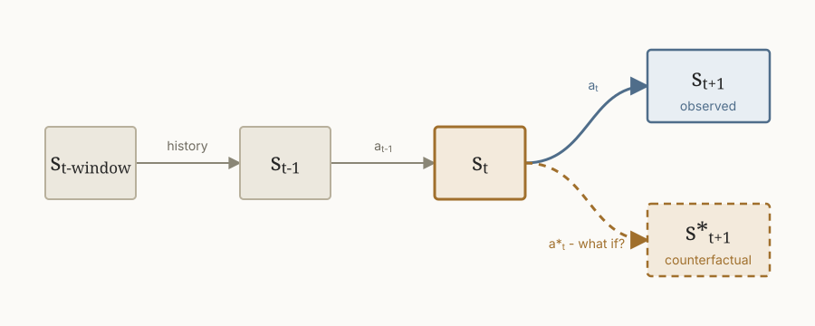
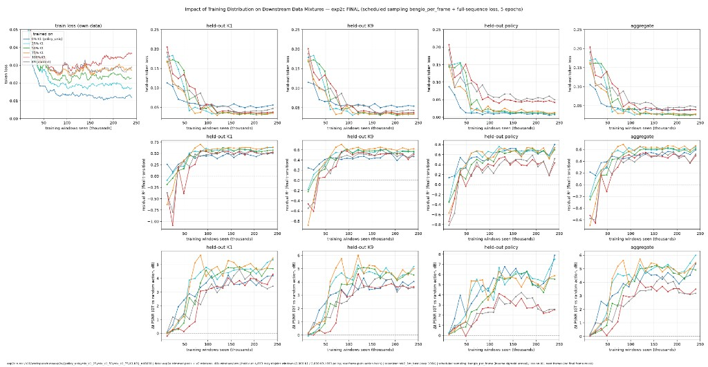

A few months ago, I wanted to understand why the world-model industry had moved away from unlabeled video data and toward extensive datasets of labeled trajectories curated with the underlying game or physics engine. I proposed that unlabeled trajectories might generate the priors necessary for intuitive physics, but I was unsuccessful in using these priors for high-fidelity, long-horizon rollouts in [World Model Priors from Unlabeled Video Data](/blogs/world_model_priors/).

Judea Pearl proposes a causal ladder that is requisite for understanding outcomes in our world [0]. I argue that the lack of coverage of this ladder is what damns unlabeled observation.

The rungs of Pearl's ladder are roughly organized as follows.

**1. Prediction (Seeing).** This is pure next-frame prediction: observational data generated from many unknown actions taken in the environment. Our model is conditioned to predict the next state, but is never informed of the impact of an intervention such as $do(a_t)$.

$$
P_\theta(s_{t+1} \mid s_{t-\mathrm{window}:t})
$$

---

**2. Intervention (Doing).** What is the likelihood of state $s_{t+1}$ given that we perform some set of actions? We learn $a_{t-\mathrm{window}:t}$ via a VQ-VAE trained on a reconstruction objective. This serves as a rough proxy for the impact of "doing."

$$
P_\theta(s_{t+1} \mid s_{t-\mathrm{window}:t}, a_{t-\mathrm{window}:t})
$$

---

**3. Counterfactuals (What if?).** Given that we have observed some set of outcomes, what would happen if we went back and changed our action at a given timestep?

$$
P_\theta(\hat{s}_{t+1} \mid s_{t-\mathrm{window}:t+1}, a_{t-\mathrm{window}:t}, \hat{a}_t)
$$

Here, $\hat{a}_t$ is the "what if" action at timestep $t$, and $\hat{s}_{t+1}$ is the unobserved state that we hope to predict via our counterfactual. We assume that the actions $a_{t-\mathrm{window}:t-1}$ and states $s_{t-\mathrm{window}:t}$ are fixed as observations. The path divergence happens at $s_t$, where we observe $s_{t+1}$ as a result of $a_t$.

<figure>
  
  <figcaption>The observed and counterfactual trajectories share a history, then diverge at the action taken from state $s_t$.</figcaption>
</figure>

### Measuring the Impact of Intervention

Each rung subsumes those below it:

$$
\text{Prediction} \subseteq \text{Intervention} \subseteq \text{Counterfactuals}.
$$

It is obvious that we covered only (1) and part of (2) in our previous experiments. Since we assumed no access to the game engine, we lacked full coverage of intervention. Because we operate in a highly constrained world where repeated states occur with non-negligible probability, I expect our coverage of intervention states to grow sublinearly with the number of data points. This suggests a scaling law for per-state interaction data compared with random exploration.

Our underlying next-state dataset is not i.i.d. and provides sparse coverage of the full state space:

- **It is not independent.** Each state depends on the prior state and action.
- **The states are a function of an exploration policy.** Actions are selected non-uniformly as a function of state, so our exploration is biased.

Lastly, I hypothesize:

> Under a fixed compute budget, per-state interaction data will provide meaningfully higher next-state reconstruction quality than the current sampling procedure.

I also hope to answer whether diversity of states is more important than diversity of actions at a given state. We can answer both questions by comparing the following data-collection procedures under a fixed compute budget:

1. Current policy-conditioned rollouts.
2. Per-state uniform selection: one randomly selected action per state (DFS).
3. Per-state full exploration: all actions explored at a given state (BFS).

It is obvious that (1) does not create diversity at scale. In the limit, both (2) and (3) should span the exploration space. These experiments will answer our questions about the importance of ladder rung 2: intervention.

### The Importance of Filling the Causal Ladder

Prediction and intervention provide the statistical correlation that allows us to map conditioning to outcome. Counterfactuals should help our model understand true causal relationships. We theorize that:

> Counterfactual training data will improve our out-of-distribution performance ceiling under a fixed compute budget.

To test this, we must add an objective that provides worthwhile counterfactuals to our model.

Critically, a counterfactual collapses to intervention if observing the ground-truth state does not provide any new information. We call this information $u_t$. If the conditional mutual information is approximately zero, the task is simply predicting the impact of $\hat{a}_t$, and we can ignore the forked trajectory:

$$
I(u_t; s_{t+1} \mid s_{t-\mathrm{window}:t}, a_t) > 0.
$$

Consider the Atari Pong game we presented previously. We might hope that $u_t$ represents information about the velocity of the ball. This is not encoded in $a_t$ and thus would provide unique knowledge useful for predicting the next frame. However, if the ball is not changing direction or coming into contact with a wall or paddle, $s_{t-\mathrm{window}:t}$ may provide all the information we need. Conditioned to predict

$$
P_\theta(\hat{s}_{t+1} \mid s_{t-\mathrm{window}:t+1}, a_{t-\mathrm{window}:t}, \hat{a}_t),
$$

our model could simply ignore $\{s_{t+1}, a_t\}$ and rely on its knowledge of intervention.

For that reason, I propose a complementary objective to our current world-modeling objective. Our model will learn to predict $\hat{s}_{t+1}$, conditioned on the forked two-frame rollout and a proposed alternative action. We will minimize:

$$
\mathcal{L}(\theta) =
\mathbb{E}_{(s_t,a_t,s_{t+1},\hat{a}_t,\hat{s}_{t+1}) \sim \mathcal{D}_{\mathrm{CF}}}
\left[
\left\lVert
\pi_\theta(s_t, s_{t+1}, a_t, \hat{a}_t) - \hat{s}_{t+1}
\right\rVert_2^2
\right].
$$

Here, we assume that our actions represent only movement of the paddles.

### Experiments

We assume the following priors:

- Access to the game engine, such that we can sample $(s_t,a_t,s_{t+1},\hat{a}_t,\hat{s}_{t+1}) \sim \mathcal{D}$.
  - We will discard our latent-action VQ-VAE and use actions taken directly from the engine instead.
- A fixed compute budget $\mathcal{N}$, representing our maximum scale in FLOPs.
- A frozen video tokenizer $\pi_{\theta_t}(s_{t-\mathrm{window}:t}) = z_{t-\mathrm{window}:t}$ that produces a sequence of discrete tokens.
- A fixed-size dynamics-model backbone $\pi_{\theta_d}(z_{t-\mathrm{window}:t}, a_{t-\mathrm{window}:t})$ that accepts tokenized states.

We evaluate at:

$$
\mathcal{N}_i \in
\left\{
2^{-5}\mathcal{N},
2^{-4}\mathcal{N},
2^{-3}\mathcal{N},
2^{-2}\mathcal{N},
2^{-1}\mathcal{N},
\mathcal{N}
\right\}.
$$

Within each comparison, both training FLOPs and the number of simulator transitions are fixed. We fix our dynamics model at 70.9M parameters ($d_{\mathrm{model}}=512$, 8 layers, 8 heads). The tokenizer is frozen at 12.7M parameters. To remove noise from dynamics-model evaluation, the tokenizer is trained over single-frame sequences.

## Experiment 1 — State vs. Action Coverage

**Question:** Under a fixed simulator budget, is it better to observe more states or more actions at each state?

For a budget of $\mathcal{B}$ frame transitions, vary the number of actions sampled per state:

$$
K \in \{1,2,4,\ldots,|\mathcal{A}|\}.
$$

Each dataset therefore contains

$$
\frac{\mathcal{B}}{K}
$$

anchor states and $K$ transitions from each state.

We compare these against ordinary policy-conditioned rollouts:

- $K=1$: maximize state diversity.
- $K=|\mathcal{A}|$: maximize intervention diversity.
- Intermediate $K$: trade state diversity for action diversity.

All conditions train with ordinary next-state prediction via negative log-likelihood:

$$
\mathcal{L}(\theta) =
\mathbb{E}_{(z_{t+1},z_{t-\mathrm{window}:t},a_{t-\mathrm{window}:t}) \sim \mathcal{D}}
\left[
-\log p_\theta(z_{t+1} \mid z_{t-\mathrm{window}:t}, a_{t-\mathrm{window}:t})
\right].
$$

We use $84 \times 84$ images and a patch size of 4, creating 441 target codes per frame. Sequence length is fixed at 4, with the frame stride between training samples set to 1. Anchor states are used solely as conditioning, and only predictions over the last frame are penalized.

For each sampling strategy, we create true held-out sets. These are sets that never appear (a) in the strategy-specific model's training data or (b) in any other model's training data.

<figure>
  
  <figcaption>Results from the $K$ experiment, comparing how different training-data mixtures transfer to held-out $K=1$, $K=9$, policy-conditioned, and aggregate evaluations.</figcaption>
</figure>

## Experiment 2 — Intervention vs. Counterfactual Prediction

**Question:** Does observing what actually happened provide information useful for predicting what would have happened under another action?

Critically, we provide the model only the state immediately before the fork—not a history window.

The intervention baseline predicts:

$$
p_\theta(\hat{z}_{t+1} \mid z_t, \hat{a}_t).
$$

The counterfactual model observes the factual transition

$$
z_t \xrightarrow{a_t} z_{t+1}
$$

before being asked what would have happened under $\hat{a}_t$:

$$
p_\theta(
\hat{z}_{t+1}
\mid
z_t, a_t, z_{t+1}, \hat{a}_t
).
$$

Thus, information such as ball velocity cannot be recovered from a preceding frame sequence. It must be inferred from the observed transition $(z_t,a_t,z_{t+1})$, which acts as evidence about the latent environment state $u_t$.

We train on the same counterfactual targets and compare:

$$
E_{\mathrm{CF}}
\quad \text{vs.} \quad
E_{\mathrm{Intervention}}.
$$

As a sanity check, we additionally replace $z_{t+1}$ with a shuffled factual outcome. If the factual transition is genuinely informative, we expect:

$$
E_{\mathrm{CF}}
<
E_{\mathrm{Intervention}}
\approx
E_{\mathrm{Shuffled}}.
$$

The main hypothesis is that this gap becomes largest out of distribution, where recovering $u_t$ from the factual transition should be more valuable.

### Architecture

This requires a small modification to the dynamics model because it must support two prediction modes with a shared backbone.

**Standard prediction**

$$
[z_t,a_t] \rightarrow z_{t+1}
$$

and **counterfactual prediction**

$$
[z_t,a_t,z_{t+1},\hat{a}_t] \rightarrow \hat{z}_{t+1}.
$$

We distinguish the two objectives with task and segment embeddings while sharing the dynamics backbone and output head.

The total training objective is:

$$
(1-\lambda)\mathcal{L}_{\mathrm{pred}} + \lambda\mathcal{L}_{\mathrm{CF}}.
$$

## Experiment 3 — Counterfactual Data Scaling

**Question:** How much counterfactual supervision is required to improve the world model?

We vary the fraction of training compute allocated to counterfactual examples:

$$
\lambda \in \left\{0, 0.01, 0.05, 0.10, 0.25, 0.50\right\}.
$$

Here, $\lambda=0$ is the standard world model, while increasing $\lambda$ replaces ordinary next-state examples with paired counterfactual examples. Total FLOPs remain fixed.

For every compute scale $\mathcal{N}_i$, we measure $E(\mathcal{N}_i,\lambda)$ on both in-distribution and out-of-distribution rollouts.

This experiment answers whether counterfactual supervision:

1. improves performance at all;
2. has diminishing returns;
3. improves only data efficiency; or
4. produces a persistently better out-of-distribution performance ceiling.

Together, these three experiments answer the core questions:

1. **How should simulator data be allocated between state and action diversity?**
2. **Does the factual transition contain useful information for predicting a counterfactual outcome?**
3. **How much counterfactual supervision is needed, and does its benefit persist with scale?**

### References

[0] Pearl, J. (2009). [Causal inference in statistics: An overview](https://doi.org/10.1214/09-SS057). *Statistics Surveys, 3*, 96–146.

[Related discussion by Gabri Berton](https://x.com/gabriberton/status/2091112055654785259).
