### Introduction

This started as an effort to reproduce the Genie paper and understand its practical challenges [2]. It evolved into an investigation of the limits of raw video as the sole learning signal, and why prevailing world model architectures have largely moved toward supervised action labels instead of latent action models.

All code is available on [GitHub](https://github.com/adb262/Gaia).

### TL;DR

In practice, unlabelled trajectories allow you to learn underlying dynamics but they do not provide enough signal to learn a general policy for navigation. This medium encodes useful information on the progression of the environment, akin to a human watching a person play a game. That human will gain some priors on the way the game works, but it is impossible for them to become an expert without playing the game directly. For world models, we must build a system on top of this that is capable of autoregressive exploration. This requires *interaction,* not just observation. Unlabeled video data is helpful for building priors but cannot take us all the way.

### Background

World models go by many definitions [0][5]. We use the functional definition of an action-conditioned model that predicts the next state $s_{t+1}$.

$$
s_{t+1} = \pi_\theta(s_{t-window:t}, a_{t-window:t})
$$

Where $\pi_\theta$ is our dynamics model, $s_t \in \mathbb{R}^{H \times W \times C}$ is our current state, $t$ is the current timestep, and $a$ are our learned quantized actions $a_{t-window:t} \in \mathbb{R}^{window \times frames - 1 \times d\_model}$. The goal is to take in some sequence of pixels over time and to output the subsequent real-valued pixel state.

For playable environments, you want the discrete action taken to be the "action" input. Genie looks at platformer games where the input is 3 dimensional (left, right, up). So, if you have a massive set of state transitions $s_t \rightarrow s_{t+1}$ and the actions that caused the transition $a_t$, you could in theory learn the policy $\pi_{\theta}$ inductively. This is useful when you have access to labelled data, but we're interested in learning from internet-scale videos. Genie does this by using a VQVAE with a next-frame reconstruction objective [14]. The structure of this model is as follows

$$
\begin{aligned}
z_t &= e_\theta(s_{t-window:t})\\
s_{t-window+1:t} &= d_\theta(s_{t-window:t}, z_t)
\end{aligned}
$$

Where the encoder $e_\theta$ is responsible for compression into our quantized latent $z_t$, and our decoder $d_\theta$ reconstructs the left-shifted window of states. The VQVAE is a spatiotemporal transformer trained via next-frame reconstruction MSE, typically employing straight through estimation to pass gradients to the encoder. At inference time you only have access to previous frames and the user input, so [2] suggest learning a mapping function from the true actions to the implicit action latent.

$$
a_{t-window:t-1} = e_\theta(s_{t-window:t})
$$

Unless otherwise noted, we use SpatioTemporal transformers with Finite Scalar Quantization [8] for our VQVAEs. FSQ allows us to circumvent the brittle codebook losses and stopgradient that is inherent when training VQVAEs. The Dynamics model is trained with MaskGIT style decoding using the Tokenizer's discrete vocabulary [3].

It is important for this architecture to be lightweight such that we can generate at 20-30 fps. For that reason we'll set a rough parameter budget of 100m.

### Dataset

Inspired by Ollin Boer Bohan [[link](https://madebyoll.in/posts/game_emulation_via_dnn/demo/)], the original goal was to do this over Pokemon data. I quickly realized that the game is far more button-mashing "A" than I previously knew. I always assumed I was just really good at the game… So, at some point we make the decision to switch to atari pong. With this we can ignore start/scoring states and simplify it to a 9 dimensional action space (down/up/none for each paddle). The theme of this section is minimal reproduction; to simplify the problem as much as possible such that we can say that our training pipeline is correct.

The videos we scraped are in 360x360, but working with large images creates a difficult learning objective and inflates memory costs.

$$
image\_size\_MB = \frac{width \times height \times channels \times precision\_bytes \times frames}{1024 * 1024}
$$

So for a 30 Hz 360x360 video in fp32, 1 second of video costs roughly (360 * 360 * 3 * 4 * 30) / (1024 * 1024) = 44.5 MB. If we naively scaled this, we're quickly dealing with multi-GB batches and enormous overhead. There are many ways to reduce this cost. First, you can reduce frame quality. Often we can get away with 128x128 or even smaller frames for our learning objective. We also certainly don't need to store FP32 values, so let's cast to 0…255 and store INT8. This will become a problem as we normalize to [0, 1], but is fine for now. Next, you can learn most of what you need in grayscale, reducing down to 1 channel. Lastly, most subsequent frames are the exact same. Qualitatively, we find 10 Hz to work quite well for this task. Doing all of this, we reduce our 1 second video cost to 0.156MB. That's a 99.7% reduction in storage cost!

There are other interesting ways of avoiding the storage costs. [Zarr arrays](https://zarr.readthedocs.io/en/stable/user-guide/arrays/) are phenomenal alternatives to the numpy standard of materializing the entire video as a giant matrix. Combining that with some dataloader pre-computation allows us to have a very cost-effective and low-overhead reading of our dataset.

We want the minimal dataset such that we can prove out this pipeline. We are hoping to learn the dynamics of the ball and paddle moving. If we simplify to this space:

1. We should filter to only frame sequences where all 3 (ball, 2 paddles) are at least partially visible.
2. We should filter to frames where there is some residual between every frame (active gameplay). This will simplify the action space to 9 dimensions.

We start with using sequences of just 5 frames to prove out our pipeline, and scale context length later on.

### Developing Genie

*Training the Video Tokenizer*

First, we must train our Tokenizer. This will give us some way to represent a video in discrete codes which are helpful for our downstream autoregressive generator. Training this tokenizer seems very simple. As we'll see later, sub-perceptible artifacts compile over time and cause reconstruction collapse.

<figure>
  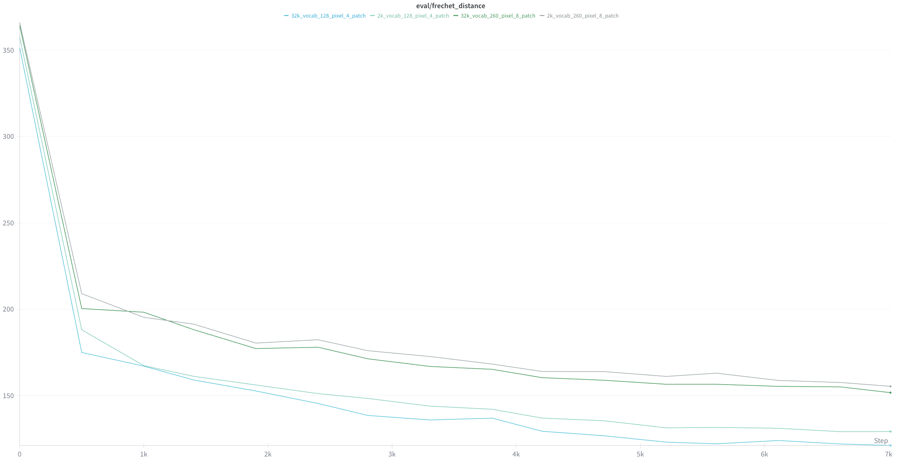
  <figcaption>Eval Fréchet distance over different latent vocabulary sizes (32k vs 2k) and image sizes. We preserve the same image size to patch size ratio for the experiments.</figcaption>
</figure>

Our ablations show us unambiguously that smaller images are simpler to learn. These ablations are run with transposed convolutions during reconstruction, which are known to cause checkerboard artifacts and increase the minimum reconstruction loss [9].

<figure>
  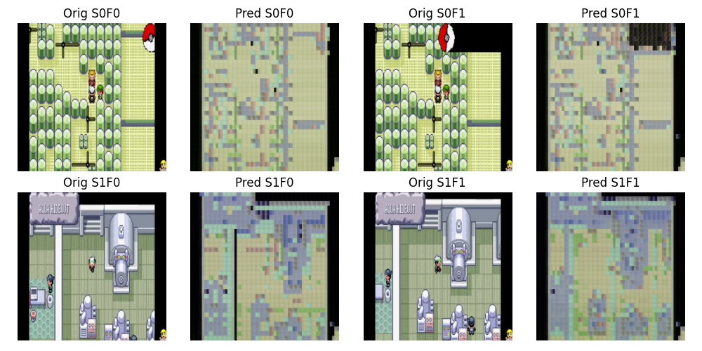
  <figcaption>Checkerboard artifacts early in Tokenizer training from transposed convolutions.</figcaption>
</figure>

Later on, we switch to sequential upsampling → interpolation architecture that dramatically reduces the artifacts.

*Co-training the Latent Action Model and Dynamics Model*

VQVAE training is notoriously finicky. Since the point of our action model is to learn what changed between frames, I find it very helpful to prioritize residuals. That is, instead of taking the mean pool at the frame level pre-quantization, compute the per-patch residual and then pool features. We see severe mode collapse with the former, and higher codebook entropy with the latter.

```python
# Split by context, target
first_images = x_encoded_full[:, :-1, :, :]
target_images = x_encoded_full[:, 1:, :, :]

# Calc residuals
residuals = target_images - first_images
residuals = residuals.mean(dim=2)

# Pass through a projection to the dimension FSQ expects
x_encoded_mean = self.action_head(residuals)
```

Empirically, we have much more diversity in our action labels. We start with > 90% utilization in our codebook. For pong, we are using a codebook of [6, 3], meaning that we have 18 "codes". This was meant to provide enough representation to encoder the angular movement of the ball in frame 0 transitions. Over time, our codebook still collapses

<figure>
  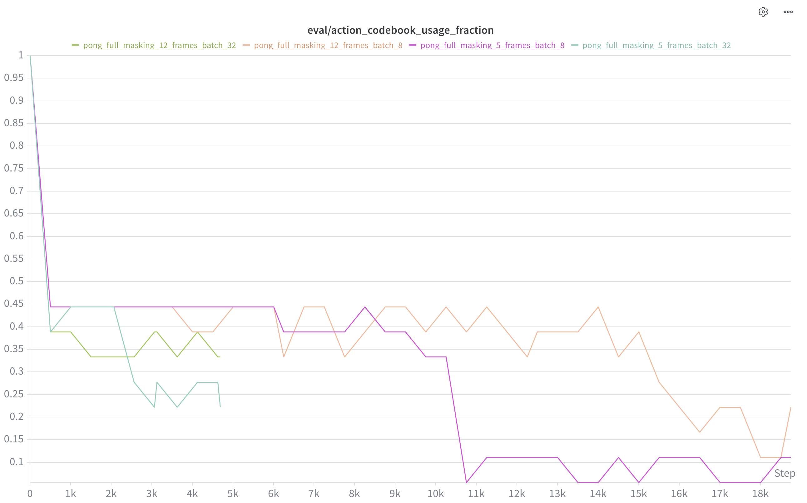
  <figcaption>Codebook usage fraction for pong collapses over time.</figcaption>
</figure>

Even though our codebook is collapsing, we see some semblance of knowledge in our dynamics model that the ball is moving. It seems it has learned to ignore the actions and track the ball movement from previous frames. Definitely not our objective but pretty cool nonetheless!

<figure>
  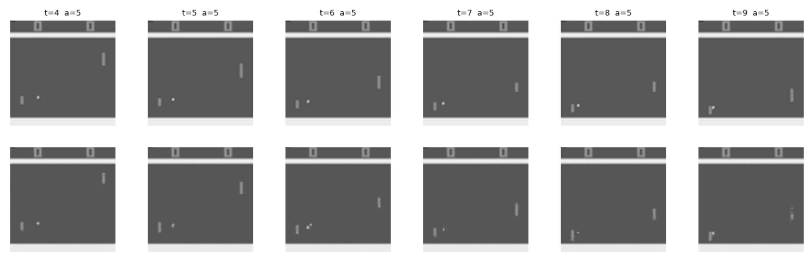
  <figcaption>Top: ground truth frame. Bottom: predicted frame by the dynamics model using the previous frames and predicted action. t={int} represents the timestep and a={int} represents our discrete code for the transition from the prior timestep.</figcaption>
</figure>

Well, sometimes.

<figure>
  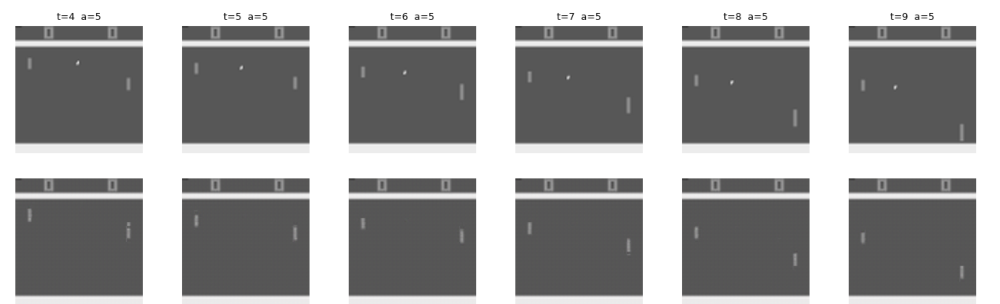
  <figcaption>A common failure mode with the ball popping in and out of existence.</figcaption>
</figure>

Interestingly, our delta PSNR is extremely high after we have mode collapse. This means that the action signal is actually being used in some fashion. I presume this is telling us "stay still" with the ball moving forward, learning to just ignore paddle movement loss.

It is clear that our dynamics model is getting very good at learning the easy pixels. Unfortunately, we are failing to learn the dynamics of *change.* This is a problem because, well, this is the only thing we care about. I have a few hypotheses here.

1. Our action model is not learning to represent any meaningful actions. Thus, it is impossible for the dynamics model to know what it should predict next. **As a result, it learns to predict the simple pixels, minimizing the loss as much as it can. For the high variance regions, it opts for the average prediction.** This is often the prior paddle placement. The average of the ball is essentially just grey pixels, because if we cannot determine movement then we are much better off predicting grey.
    1. This comes despite us using FSQ, which is resilient to collapse. Other implementations (AlmondGod/TinyWorlds) use some regularizing of the FSQ. I disagree with this fundamentally, as the algorithm itself should require no explicit codebook loss. The principles of the quantization elide the need for it.
2. The dynamics model cares too much about the low variance regions. **Our objectives are misaligned.** The objective for both action model and dynamics model promotes pixel level reconstruction. We don't care about 99% of the pixels.

*Addressing these problems*

The action model should only care about representing change. So, why don't we reformat our objective to predict the residual itself? This represents a highly sparse picture of exactly the change we hope to represent.

Let's start by visualizing what predicting the residual would look like.

<figure>
  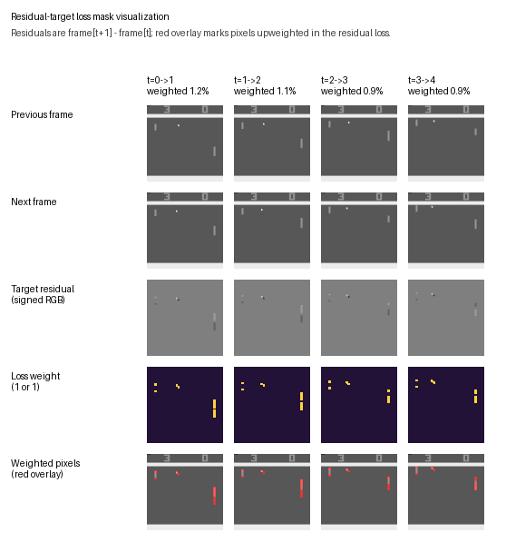
  <figcaption>Visualization of what pure residual loss would penalize. We can learn to ignore or downweight all <em>easy</em> pixels and focus on learning the change.</figcaption>
</figure>

One issue with this is that we are potentially dramatically reducing the amount of training data we have. Instead of predicting an n x n grid, we will be predicting k << n pixels. We opt for a pure residual loss for the decoder. Let's run the experiment.

<figure>
  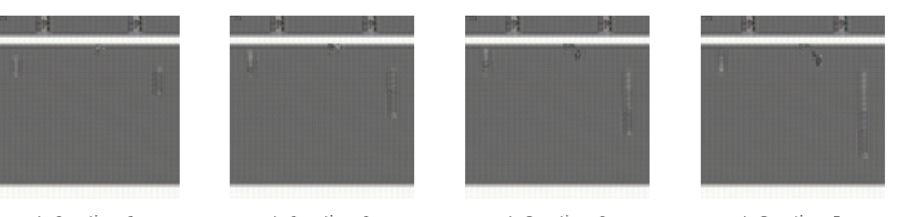
  <figcaption>Our predicted images (with our predicted residual addition) after 1k steps.</figcaption>
</figure>

Our loss continues to decrease dramatically after this step. After a few thousand more steps, some really interesting patterns emerge.

<figure>
  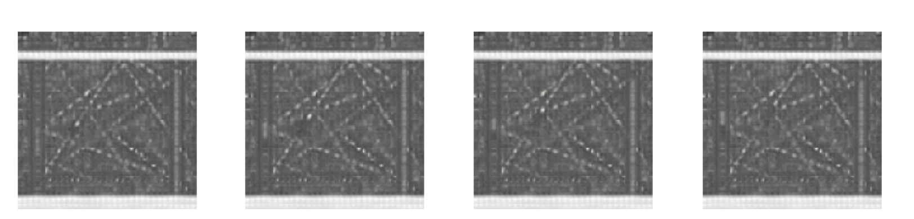
  <figcaption>Action Decoder prediction (3k steps)</figcaption>
</figure>

We collapse onto this representation. It looks to be mostly noise, but you'll notice some consistencies. The action model has learned to predict the most frequent trajectories of the ball and the paddles! You can see the density of the regions represented in our training data. In hindsight, this is because of a poor loss formulation. The loss completely disregards all other pixels than those with non-zero residual. The actions are relatively low entropy and the dynamics model training does not improve. We move forward with full reconstruction loss as our baseline.

So our hypothesis was that the simple pixels don't matter. The background and scoreboard, roughly 99% of all pixels, are relatively unimportant for understanding progression. There are many ways to try to stabilize this in the objective. SimPLe frames it as a "Clipped Loss" [7].

> We found that clipping was crucial for improving the models (measured with the correct reward predictions per sequence metric and successful training using Algorithm 1). We conjecture that clipping substantially decreases the magnitude of gradients stemming from fine-tuning of big areas of background consequently letting the optimization process concentrate on small but important areas (e.g. the ball in Pong). In our experiments, we set C = 10 for L2 loss on pixel values and to C = 0.03 for softmax loss. Note that this means that when the level of confidence about the correct pixel value exceeds 97% (as − ln(0.97) ≈ 0.03) we get no gradients from that pixel any longer.

In theory these improvements help ensure that we're focusing on the *difficult* pixels.

<div class="figure-row">
<figure>
  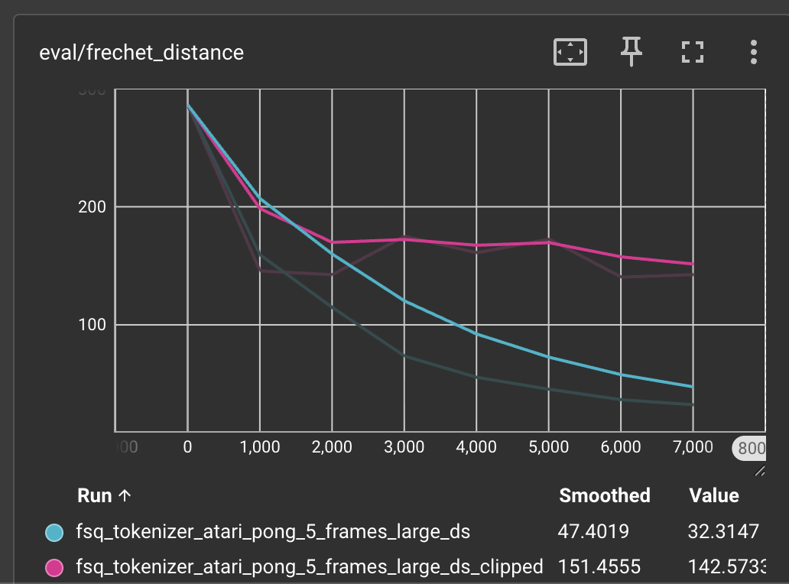
</figure>
<figure>
  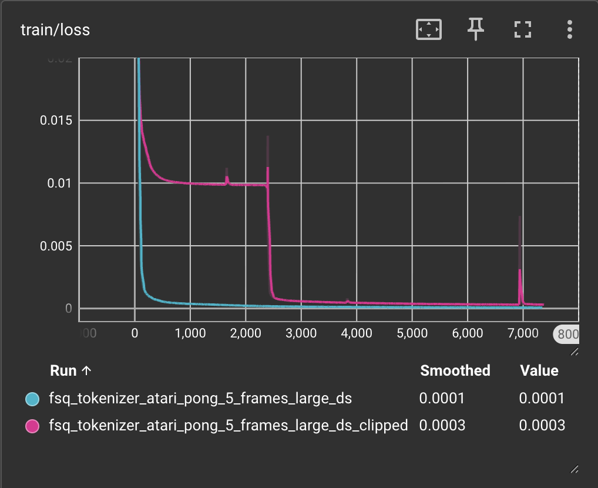
</figure>
<figure>
  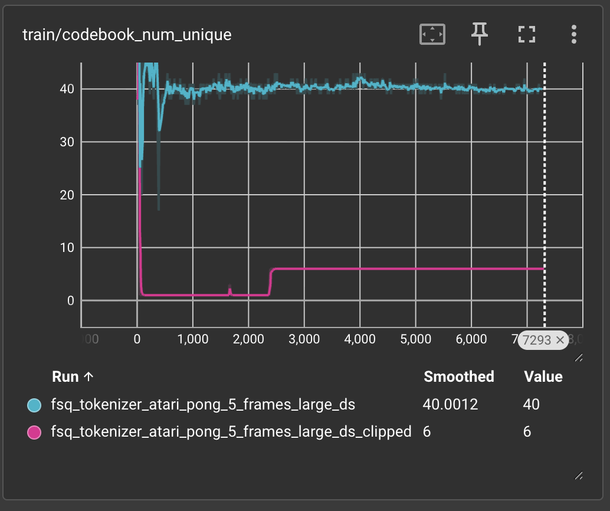
</figure>
</div>

In practice, we see materially worse FVD and codebook utilization when using this clipping objective. We do not use the clipped loss going forward. There is also a lot of interest in using a more semantic loss, but I leave that for future work [6][17].

*Architectural Upgrades*

We have hit a wall on reconstruction quality. The Tokenizer decoder is used actively at inference time, and any issues with this output will compound over time. If we cannot provide some high fidelity mapping of pixels → tokens and vice versa, our AR predictor has no chance. With each prediction we progress further from our training distribution.

Upon investigation of the tokenizer, I was able to find a number of opportunities to improve:

1. Switching from transposed convolutions to a non-linear sequential conv + bilinear interpolation pipeline.
2. Upgrade from LayerNorm to RMSNorm [15][16].
3. Incorporate SwiGLU for better activation expressivity [12].
4. We were not handling residual connections and/or normalization correctly. We want to apply normalization before Attention/FFN, then combine the pre-norm residual post attention/ffn. Properly handle residual connections!
5. We updated the ST transformers to apply the rotary positional embeddings *after* QKV projection [16]. We saw substantial performance improvements from fixing this bug.

The quality of generation goes up immensely. An interesting trend also emerges. After our first few steps, our codebook usage drops to near 0. This is because our model is finding a local minima that comes from generating pure grey. Over time, this trend reverses. Our codebook usage trends upwards as we learn more complex, finer grained details. That is, until we hit a massive loss spike.

<div class="figure-row">
<figure>
  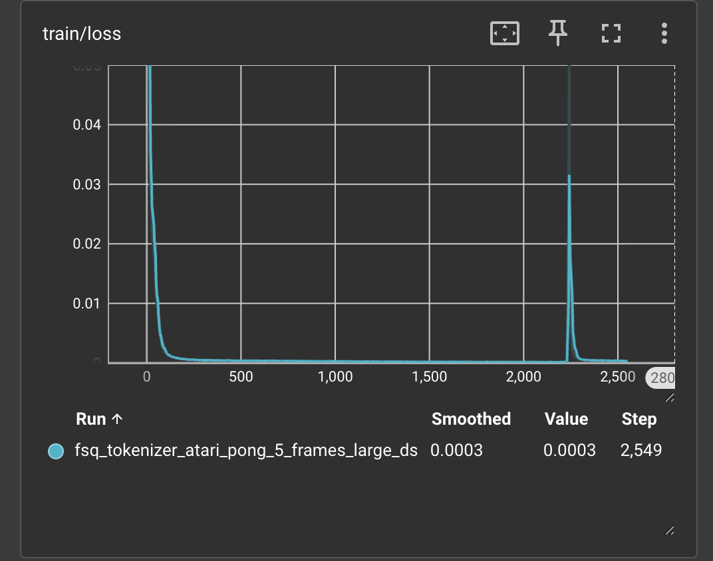
</figure>
<figure>
  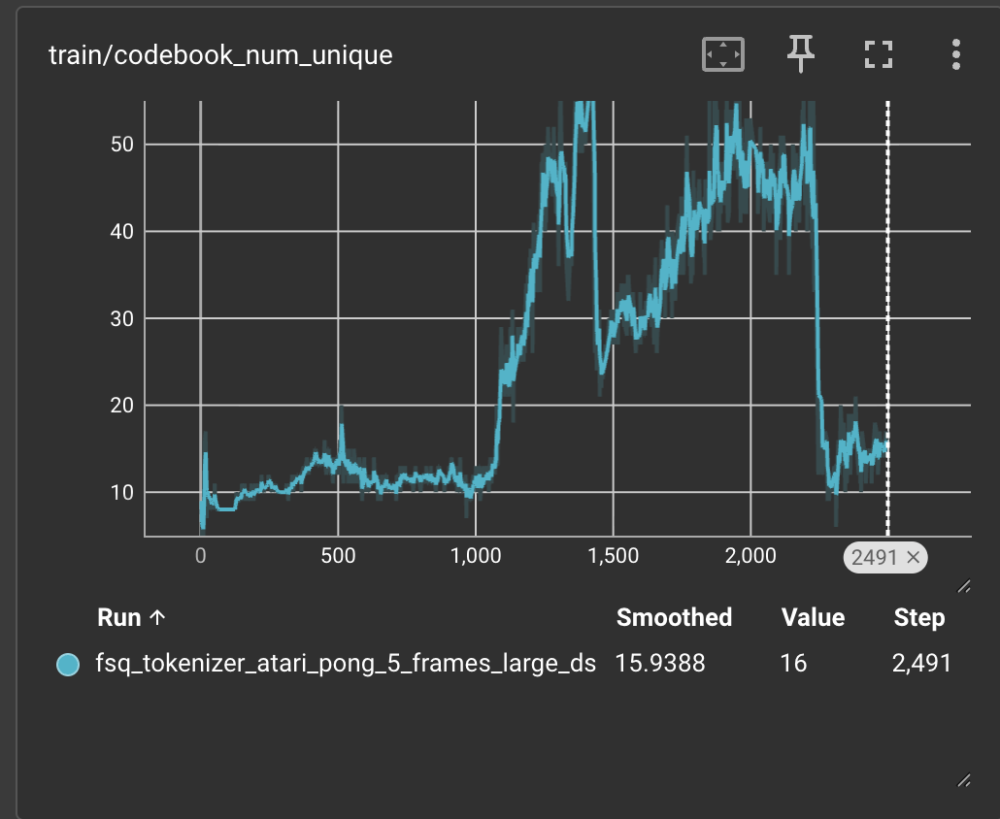
</figure>
</div>

We seem to be more prone to loss spikes. This could be because our model is not seeing any gradient from these "close" pixels, and thus it is learning on them randomly. At some point, some poor behavior is canalized. The codebook entropy is far higher on the non-clipped objective.

This upgrade to the tokenizer worked quite well. All of the images are extremely high fidelity. Using the latest checkpoint, we proceed with co-training of our action and dynamics models.

<figure>
  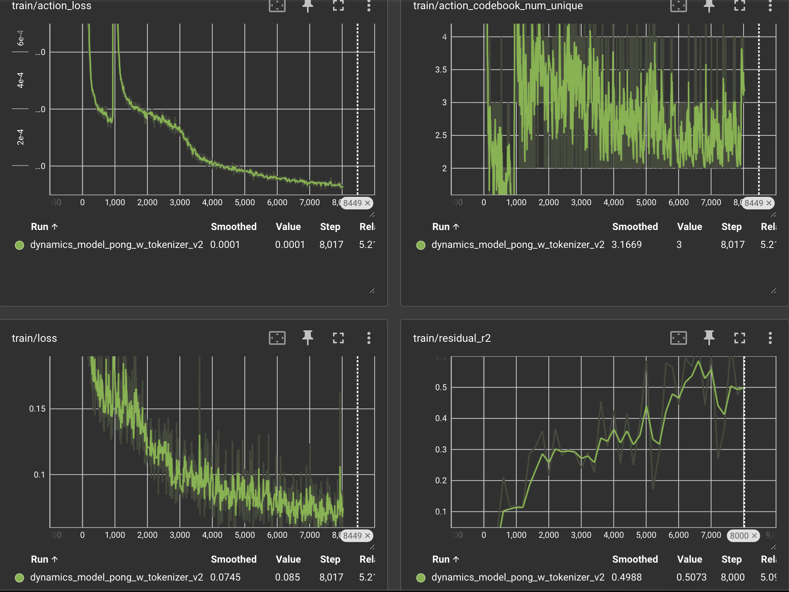
  <figcaption>The results of training a very small action model (30m params), with a 70m param dynamics model.</figcaption>
</figure>

Learning rate is highly important here. After a sweep, we find that the optimal LR was 5e-5 for action, 1e-4 for dynamics. Dropping the LR hurts perf quite a bit, not just convergence time. We find dataset filtering and gradient clipping to be incredibly important in mitigating loss spikes. After this, we *should* be ready to follow Bengio and mix in our inference results during training.

<div class="figure-row">
<figure>
  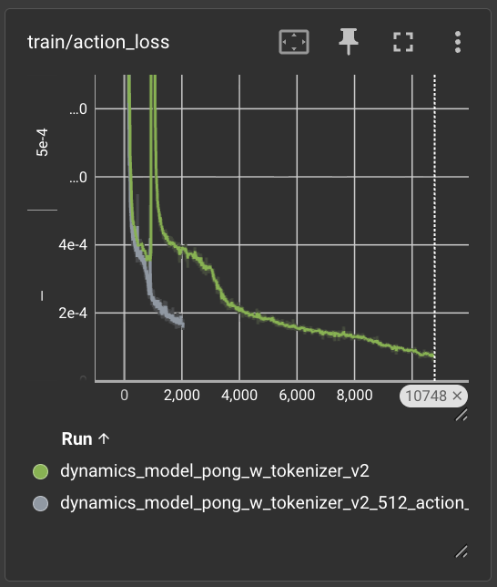
</figure>
<figure>
  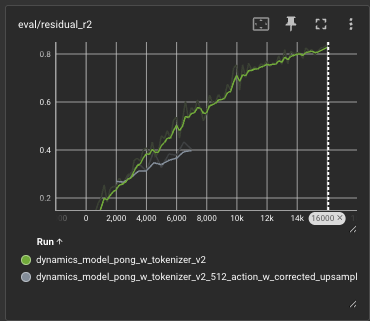
</figure>
<figure>
  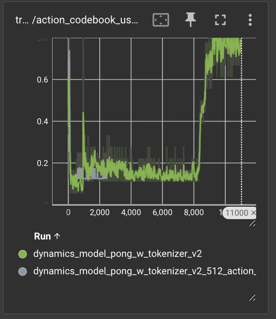
</figure>
</div>

It's beautiful…. Yet we still see some training instability. I have two hypotheses for the gradient spikes:

1. Small batch size of 16. To address that I have scaled up our batch size to be 48 in `dynamics_model_pong_w_tokenizer_v2_256_action_w_corrected_upsample_dim_and_patch`, and 16 frames x 24 in `dynamics_model_pong_w_tokenizer_v2_256_action_w_corrected_upsample_dim_and_patch_16`.
2. The model is fighting to get out of its local minima. It has learned an overly simplistic representation that fits the action loss well but does not support our co-training.
    1. We can validate this by comparing our copy-previous MSE to our action_loss (MSE as well) at the time of the spike. Our MSE was 3.61e-4 right before the spike. Our MSE for copying the previous frame is … ~3.3e-4!

<figure class="narrow">
  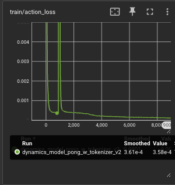
</figure>

### Towards Utility

We're able to train a pretty reasonable model, but the representations collapse after one rollout. It's time for scheduled sampling [1]. We want our sampling rate to be a function of how far into training we are, growing more likely as the training goes on. At the end of training we should be training off of entirely autoregressively sampled trajectories, perfectly mimicking inference.

<figure>
  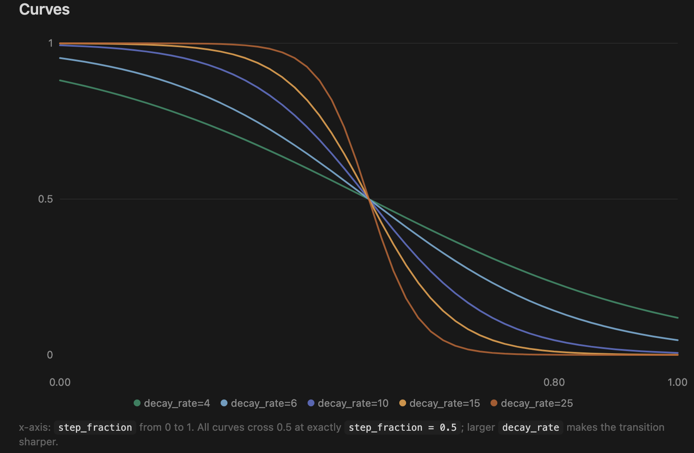
  <figcaption>We implement the inverted sigmoid based on <code>step_fraction</code> and <code>decay_rate</code>. For our experiments we use a <code>decay_rate</code> of 10. <code>eps=0</code> means that we will always use the generated frames as our prior, <code>eps=1</code> means that we are grounded on purely GT frames.</figcaption>
</figure>

We implement the Bengio style scheduled sampling and see that our training is extremely slow. It is hard to get feedback on even small experiments because we're performing 25 denoising steps for each frame in our `num_frames_in_video`. Since this is a purely sequential operation, this is naturally extremely slow. Implementing a KV cache and/or using parallel scheduled sampling [4] [[paper](https://arxiv.org/abs/1906.04331)] would speed up training, but the simplest implementation is the least risky for now. Instead, we explore a few straightforward optimizations.

1. Allow mixed precision training. Using torch.amp, we train our tokenizer, action model, and dynamics model in BF16.
2. Torch compilation for faster training.
3. Only generating when the mini-batch epsilon tells us we need to. This means that our batch time goes up dramatically as our `eps` converges to 0 later in training. Early in training, we are never sampling.
4. Reducing the number of denoising steps for MaskGIT

I want to spend a second discussing (4). The Genie paper uses 25 sequential denoising steps on a cosine scheduler. Originally, we abided by this as the blind ground truth. I wanted to explore what happens as we decrease this. How is quality affected?

<figure>
  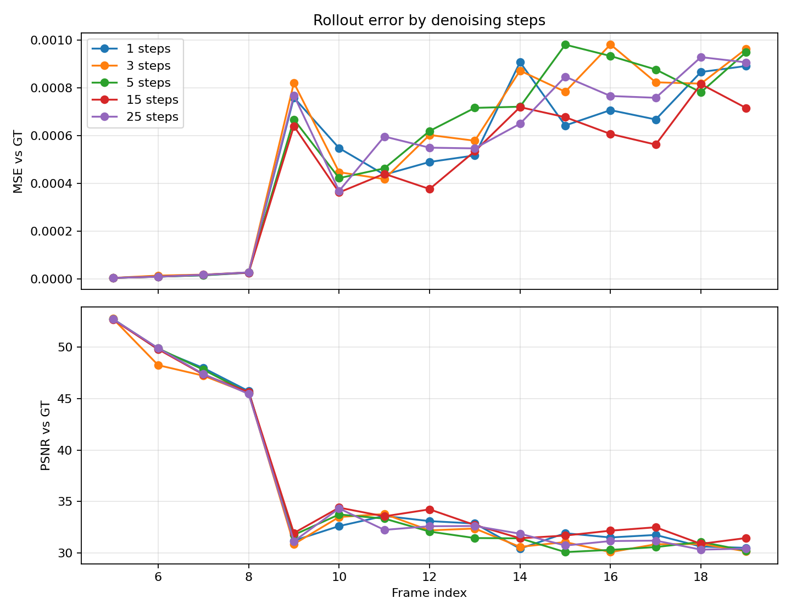
  <figcaption>Number of denoising steps does not seem to have a substantial impact on quality.</figcaption>
</figure>

It appears that there is roughly no tie to the number of denoising steps. Our model is extremely confident on most of the pixels out of the box. This is potentially an issue with our non-stochastic sampling, but opened up an interesting question: Why not just do one denoising step?

<div class="figure-row">
<figure>
  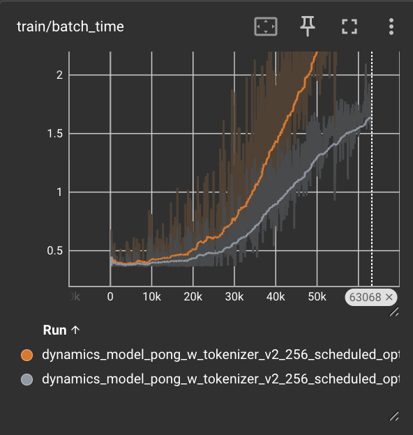
  <figcaption>Batch time for 5 denoising steps (orange) vs 1 denoising step (grey)</figcaption>
</figure>
<figure>
  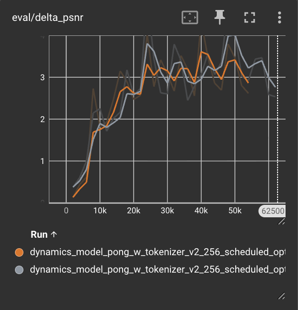
  <figcaption>Delta PSNR for 5 denoising steps (orange) vs 1 denoising step (grey)</figcaption>
</figure>
</div>

<figure class="narrow">
  <video src="denoising-errors.mp4" controls loop muted playsinline preload="metadata"></video>
  <figcaption>Residual error vs number of denoising steps for each generation</figcaption>
</figure>

This lever doesn't seem to matter for our current setup. So, let's just use 1!

<figure class="narrow">
  <video src="live.mp4" controls loop muted playsinline preload="metadata"></video>
  <figcaption>A 10 frame rollout on our 20m param dynamics model that was trained with videos of length 5. We see a sharp degradation in quality at frame 6.</figcaption>
</figure>

It looks great! Until… it doesn't. We see a sharp dropoff after the 5th frame. This is exactly our training context: 5 frames. Beyond this point we see a dramatic degradation. Our model doesn't know how to handle the compounded error of the last frame as context.

There are several concerns here, but one thought is to scale our context window. The more noise that our model has experience predicting over, the less likely we are to have dramatic collapse. We see some interesting patterns emerge.

<div class="figure-row">
<figure>
  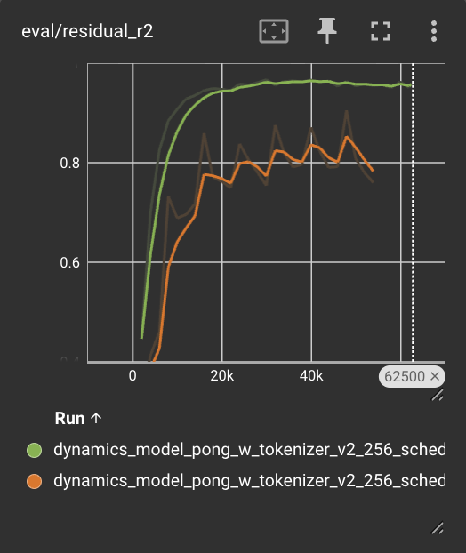
  <figcaption>Residual r**2 for 5 frame videos (green) vs 16 frame videos (orange)</figcaption>
</figure>
<figure>
  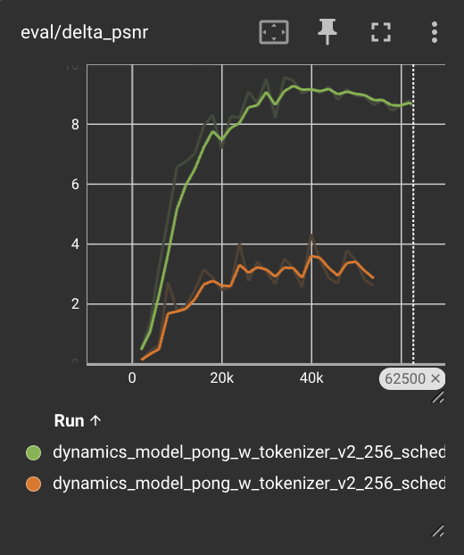
  <figcaption>Delta PSNR for 5 frame videos (green) vs 16 frame videos (orange)</figcaption>
</figure>
</div>

Both of these are using the same architecture. It is quite clear that learning over 5 frames is substantially easier than learning over 16. If we say that we must train with a larger context window, what are our levers?

<figure>
  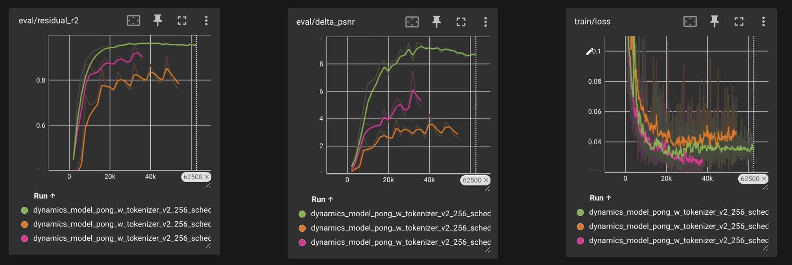
  <figcaption>Effects of increasing <code>d_model</code> for the dynamics model from 256 to 512. With increased representational capacity, we are much more adaptable to the long frame context. Pink is <code>d_model=512</code> for $num\_frames\_in\_video=16$, orange is <code>d_model=256</code> for $num\_frames\_in\_video=16$, green is <code>d_model=256</code> for $num\_frames\_in\_video=5$. Since we scale some internal layers with <code>d_model</code>, this comes at about a 4x cost.</figcaption>
</figure>

All of the experiments above are using a 9m decoder and 17m tokenizer. `d_model=256` equates to ~20m parameters, while `d_model=512` equates to ~80m. I decide its alright to eat the cost for now. Let's get something to work and we can optimize later.

### Results

Things look pretty good!

<figure class="narrow">
  <video src="rollout-with-collapse.mp4" controls loop muted playsinline preload="metadata"></video>
  <figcaption>Naive sliding window rollout of the pipeline. Training done using scheduled sampling.</figcaption>
</figure>

However, we still see collapse as soon as we go beyond our trained-on context length. I investigated some different inference strategies. Interestingly, pinning the ground truth f0 seems to help with stability quite a bit. I attribute this to the first frame emerging as a useful attention sink during training. Though since we're dropping intermediate frames, we are quickly of distribution.

<figure class="narrow">
  <video src="rollout-strategies-with-collapse.mp4" controls loop muted playsinline preload="metadata"></video>
  <figcaption>Different rollout strategies and their impact on AR generation quality over time.</figcaption>
</figure>

 The rolling window strategies all fail as a result of the gradual compounding error in our experiments. This leaves us with one of two possibilities:

1. The Tokenizer gradually introduces error that cannot be recovered from.
2. The dynamics model cannot generalize to larger noise levels than what it sees during training

(1) is fairly simple to test. We can take a ground truth video sequence of `n` frames, pass through encode → decode of the tokenizer, use these frames as context, and observe any loss in reconstruction quality.

<figure>
  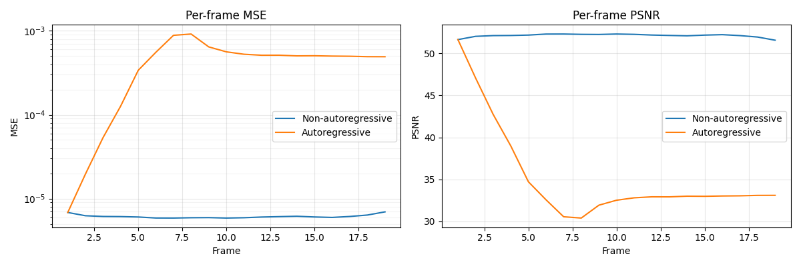
  <figcaption>Autoregressive vs non-autoregressive rollouts of our Video Tokenizer.</figcaption>
</figure>

<figure>
  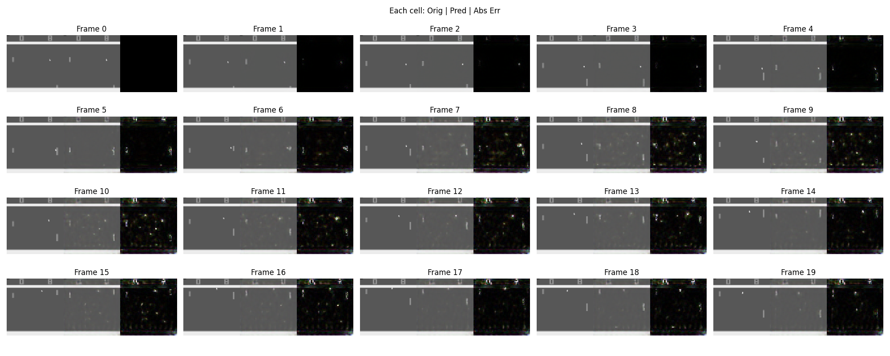
  <figcaption>Compounding residual error for our tokenizer. The predicted frame is a function of predicted frames &lt; t.</figcaption>
</figure>

We see a dramatic drop in quality when we use the generated frames as context. Intuitively, the tokenizer should also be trained with some form of scheduled sampling. Unfortunately, we have a bit of a chicken and the egg problem. So, we propose to "post-train" the tokenizer by passing in the proposed generations as context. We effectively perform full autoregressive rollouts and preserve our reconstruction penalty.

<figure>
  <video src="post-trained-tokenizer-rollout.mp4" controls loop muted playsinline preload="metadata"></video>
  <figcaption>Left: ground truth rollout. Middle: predicted full autoregressive rollout. Right: residual error.</figcaption>
</figure>

<figure>
  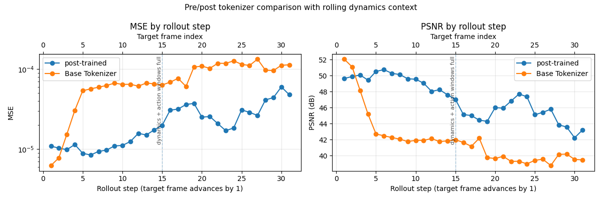
  <figcaption>Difference in our base tokenizer compared to the post-trained autoregressive tokenizer. We see better initial performance with the base tokenizer, but it quickly degrades. The tokenizer that has seen our inference rollouts outperforms as sequence length grows.</figcaption>
</figure>

We use the outputs of the dynamics model as the inputs according to the same scheduled sampling strategy used for the dynamics model. This allows us to bridge the gap a bit.

### Making it Playable

There is one more thing for us to do. When we serve this to users, they would press up, down, or nothing at each timestep. This limits us to an interpretable 3 x 3 dimensional input at each timestep. Right now, our actions are arbitrarily defined by our VQVAE, spanning 24 dimensions. We should be able to learn a lightweight mapping over a small number of examples that bridges this gap.

Our action model is trained to predict $a_t$ by looking at the residuals between frames. For that reason, it needs access to the target frame during train time. At test time, we just pass in the quantized latent to our dynamics model in order to produce that very target frame. So, we want to learn a function that does not rely on target frames. It should be able to take in the user input at that timestep, as well as the current frame window. We defined our mappings as follows.

$$
\begin{aligned}
\hat{p}_{t-window:t-1}(\cdot) &= \sigma(f_\theta(s_{t-window:t-1}, i_{t-window:t-1}))\\
L(\theta) &= \frac{1}{window - 1}\sum^{t - 1}_{i=t-window}\log(\hat{p}_\theta(a_i))
\end{aligned}
$$

Where $i$ is the 9 dimensional human-interpretable input, $e_\theta$ is our action encoder. Our mapping function $f_\theta$ depends only on the current action and the current frame context.

<figure>
  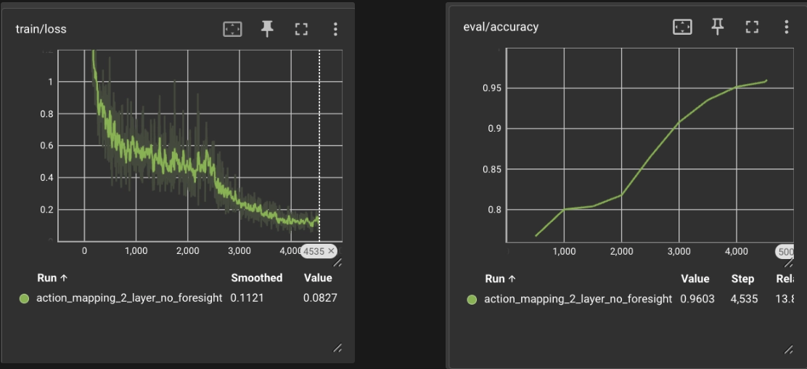
  <figcaption>Mapping function train loss and eval accuracy</figcaption>
</figure>

For simplicity, the mapping function is trained on purely ground truth data. We use a variant of the spatiotemporal transformer, followed by an affine classification head. This model can be incredibly small.

There are still some quality issues, but our game is actually playable! From our probing of model scale, throwing more FLOPs and lengthening our time under full autoregressive training should continue to improve the quality.

### Conclusions

The main theme of our takeaways is that we must close the train/inference gap at all costs.

1. **Scheduled sampling is absolutely necessary in training.** Without scheduled sampling, our model performance degrades rapidly as we generate new frames.
2. **Since future frames always depend on previously predicted actions, we violate our I.I.D. assumption.** DAGGER style training can ensure that our model learns to navigate back from the weird scenarios it gets itself into [10]. The model needs to be able to rollout and see what it should produce.
3. **Training many different parts creates a chicken and the egg problem.** We must consistently go back and allow autoregressive learning. A single monolith is always better.
4. **Always use the residual highway.** Straightforward.
5. **Applying normalization before FFNs and Attention (Pre-LN) helps training stability.** There is an important caveat though, which is **do not apply normalization after quantization.** The catastrophic impact can best be visualized when we consider the case when we use `bins=[8]`. In this case, our quantization output is a scalar. If we apply LayerNorm over this, we go directly to 0!
6. **Coding models are not yet researchers.** These models make many assumptions. Even using the latest series (GPT 5.5 and Opus 4.7), we see a real lack of understanding. They never push back. Several mistakes were due to oversight and a lengthy leash, which I quickly reeled in. I ended up implementing most of the model code by hand and relying on codegen for the visualizations.

### Closing Remarks

The original Genie paper uses *inferred actions,* not relying on any ground truth inputs aside from a small alignment stage at the end. This is an incredibly useful research direction, as it would unlock internet scale unlabeled data. I believe (1) and (2) are the reasons that DeepMind has gone away from unlabeled trajectories. I conclude with the following statement

> Inferring actions without labels is valuable for learning the dynamics of the world, but deployment depends on autoregressive robustness. The model needs experience recovering from its own predictions.

So, the natural next question would be: Is there any way to get DAGGER style recovery training without access to the underlying environment?

### Aside: Can you find the bug?

I found a very interesting bug that is particularly accute with 1 dimensional quantization (bins=[8]). Can you spot it here?

```python
action_projection = nn.Sequential(
    nn.LayerNorm(len(bins)),
    nn.Linear(len(bins), 4 * d_model),
    nn.GELU(),
    nn.Linear(4 * d_model, d_model),
)
...

quantized = fsq_encoder(x)
action_projection(quantized)
```

---

**Solution**

We had this projection that occurred after we cast to our quantized latent. This latent is of dimension `len(bins)`. Using `LayerNorm(1)` always results in 0.

The LayerNorm equation:

$$
y = \frac{x - \mu}{\sqrt{\sigma^2 + \epsilon}} \cdot \gamma + \beta
$$

We only have 1 $x$! So our numerator is always 0. Therefore, our LayerNorm removes all signal from the quantization.

### Citations

[0] Bamford, C. and Lucas, S. 2020. Neural Game Engine: Accurate learning of generalizable forward models from pixels. In *Proceedings of the IEEE Conference on Games (CoG)*. IEEE.

[1] Bengio, S., Vinyals, O., Jaitly, N., and Shazeer, N. 2015. Scheduled Sampling for Sequence Prediction with Recurrent Neural Networks. In *Advances in Neural Information Processing Systems 28 (NeurIPS)*.

[2] Bruce, J., Dennis, M., Edwards, A., Parker-Holder, J., Shi, Y., Hughes, E., Lai, M., Mavalankar, A., Steigerwald, R., Apps, C., Aytar, Y., Bechtle, S., Behbahani, F., Chan, S., Heess, N., Gonzalez, L., Osindero, S., Ozair, S., Reed, S., Zhang, J., Zolna, K., Clune, J., de Freitas, N., Singh, S., and Rocktäschel, T. 2024. Genie: Generative Interactive Environments. *arXiv preprint arXiv:2402.15391*.

[3] Chang, H., Zhang, H., Jiang, L., Liu, C., and Freeman, W. T. 2022. MaskGIT: Masked Generative Image Transformer. In *Proceedings of the IEEE/CVF Conference on Computer Vision and Pattern Recognition (CVPR)*, 11315–11325.

[4] Duckworth, D., Neelakantan, A., Goodrich, B., Kaiser, and Bengio, S. 2019. Parallel Scheduled Sampling. *arXiv preprint arXiv:1906.04331*.

[5] Ha, D. and Schmidhuber, J. 2018. World Models. *arXiv preprint arXiv:1803.10122*.

[6] Johnson, J., Alahi, A., and Fei-Fei, L. 2016. Perceptual Losses for Real-Time Style Transfer and Super-Resolution. In *European Conference on Computer Vision (ECCV)*.

[7] Kaiser, Ł., Babaeizadeh, M., Miłos, P., Osiński, B., Campbell, R. H., Czechowski, K., Erhan, D., Finn, C., Kozakowski, P., Levine, S., Mohiuddin, A., Sepassi, R., Tucker, G., and Michalewski, H. 2019. Model-Based Reinforcement Learning for Atari. *arXiv preprint arXiv:1903.00374*.

[8] Mentzer, F., Minnen, D., Agustsson, E., and Tschannen, M. 2023. Finite Scalar Quantization: VQ-VAE Made Simple. *arXiv preprint arXiv:2309.15505*.

[9] Odena, A., Dumoulin, V., and Olah, C. 2016. Deconvolution and Checkerboard Artifacts. *Distill*. DOI: 10.23915/distill.00003.

[10] Ross, S., Gordon, G., and Bagnell, J. A. 2011. A Reduction of Imitation Learning and Structured Prediction to No-Regret Online Learning. In *Proceedings of the Fourteenth International Conference on Artificial Intelligence and Statistics (AISTATS)*, PMLR 15:627–635.

[11] Schmidhuber, J. 1990. Making the World Differentiable: On Using Self-Supervised Fully Recurrent Neural Networks for Dynamic Reinforcement Learning and Planning in Non-Stationary Environments. Technical Report FKI-126-90, Technische Universität München.

[12] Shazeer, N. 2020. GLU Variants Improve Transformer. *arXiv preprint arXiv:2002.05202*.

[13] Su, J., Lu, Y., Pan, S., Murtadha, A., Wen, B., and Liu, Y. 2024. RoFormer: Enhanced Transformer with Rotary Position Embedding. *Neurocomputing* 568:127063. DOI: 10.1016/j.neucom.2023.127063.

[14] Van den Oord, A., Vinyals, O., and Kavukcuoglu, K. 2017. Neural Discrete Representation Learning. *arXiv preprint arXiv:1711.00937*.

[15] Xiong, R., Yang, Y., He, D., Zheng, K., Zheng, S., Xing, C., Zhang, H., Lan, Y., Wang, L., and Liu, T.-Y. 2020. On Layer Normalization in the Transformer Architecture. *arXiv preprint arXiv:2002.04745*.

[16] Zhang, B. and Sennrich, R. 2019. Root Mean Square Layer Normalization. In *Advances in Neural Information Processing Systems 32 (NeurIPS)*.

[17] Zhang, R., Isola, P., Efros, A. A., Shechtman, E., and Wang, O. 2018. The Unreasonable Effectiveness of Deep Features as a Perceptual Metric. In *Proceedings of the IEEE/CVF Conference on Computer Vision and Pattern Recognition (CVPR)*, 586–595. DOI: 10.1109/CVPR.2018.00068.
